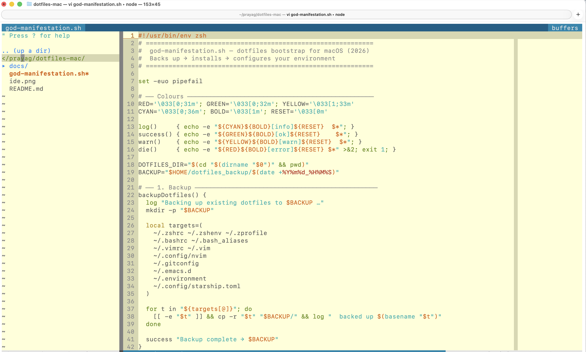

# dotfiles-mac

Personal macOS dotfiles and environment bootstrap — 2026 edition.

## What gets installed

| Category | Tools |
|---|---|
| **Shell** | zsh + [Starship](https://starship.rs) prompt |
| **Editor** | Neovim + Vim (vim-plug for plugins) |
| **Terminal** | WezTerm + JetBrains Mono Nerd Font |
| **CLI** | `ripgrep`, `fzf`, `bat`, `eza`, `zoxide`, `fd`, `jq`, `tmux`, `direnv` |
| **Git** | `git-delta` as diff pager, GitHub CLI (`gh`) |
| **Runtime mgr** | `mise` (replaces nvm / rbenv / pyenv) |
| **Package mgr** | Homebrew (auto-installed if missing) |

## Installation

```bash
git clone https://github.com/prayagupa/dotfiles-mac.git
cd dotfiles-mac/
./god-manifestation.sh
# restart terminal
```

The script will:

1. **Backup** existing dotfiles to `~/dotfiles_backup/<timestamp>/`
2. **Install Homebrew** (or update if already present) and all packages/casks
3. **Copy configs** — shell, vim, neovim, starship, git, etc.
4. **Install vim-plug** and run `:PlugInstall` headlessly for both Vim and Neovim
5. **Configure fzf** shell keybindings and completions
6. **Set git-delta** as the global diff/pager tool
7. **Set zsh** as the default shell
8. **Apply macOS defaults** (key repeat, Finder, etc.)

## Layout

```
dotfiles-mac/
├── god-manifestation.sh   # bootstrap entrypoint
├── .vimrc                 # Vim config (vim-plug)
├── .zshrc                 # Zsh config (primary shell config)
├── .bashrc / .bash_*      # Bash fallback configs
├── .gitconfig             # Git config
├── .environment           # Exported env vars
├── .config/
│   ├── nvim/              # Neovim config
│   └── starship.toml      # Starship prompt theme
└── .emacs.d/              # Emacs config (legacy)
```

## Docs

| Doc | Covers |
|---|---|
| [docs/shell.md](docs/shell.md) | zsh, Starship prompt, fzf, zoxide, direnv |
| [docs/editor.md](docs/editor.md) | Neovim, Vim, vim-plug, WezTerm, Nerd Font |
| [docs/cli-tools.md](docs/cli-tools.md) | ripgrep, fd, bat, eza, git-delta, gh, tmux, jq, mise, Homebrew |

## Editor

`C-n` — toggle file explorer



## Updating your local machine

After pulling the latest dotfiles from the repo, re-run the bootstrap to apply changes:

```bash
cd dotfiles-mac/
git pull
./god-manifestation.sh
# restart terminal
```

Or apply individual pieces manually:

```bash
# Prompt config only
cp .config/starship.toml ~/.config/starship.toml

# Shell configs only
cp .bash_profile ~/.bash_profile && source ~/.bash_profile
cp .bashrc ~/.bashrc && source ~/.bashrc

# Vim plugins
vim +PlugUpdate +qall

# Homebrew packages
brew bundle          # if you add a Brewfile later
brew upgrade
```

## Prompt (Starship)

The old `.bash_prompt` (Solarized bash PS1) has been replaced by [Starship](https://starship.rs). Config lives in [.config/starship.toml](.config/starship.toml) and mirrors the original look:

- `user` in yellow, red when root
- `hostname` in red (SSH only)
- `directory` in green
- `branch` in purple with `+!?$` status flags + ahead/behind counts

To activate in an existing shell session:

```bash
# zsh
echo 'eval "$(starship init zsh)"' >> ~/.zshrc && source ~/.zshrc

# bash
echo 'eval "$(starship init bash)"' >> ~/.bash_profile && source ~/.bash_profile
```

## General dotfiles

https://github.com/prayagupa/dotfiles
